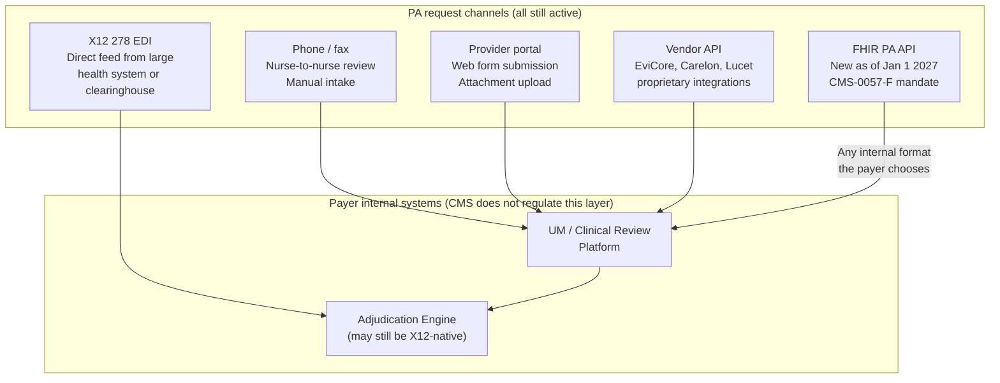
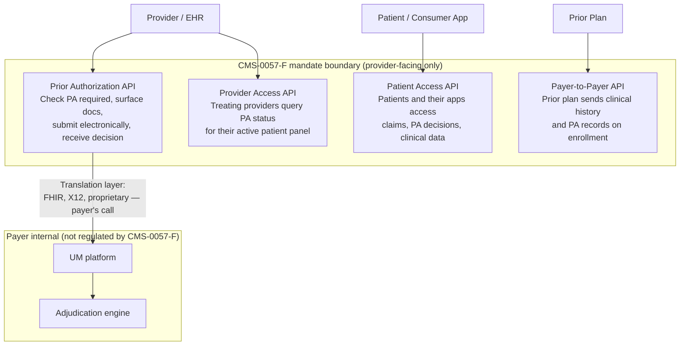
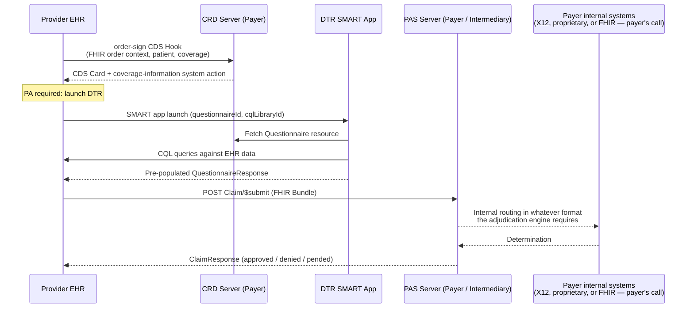
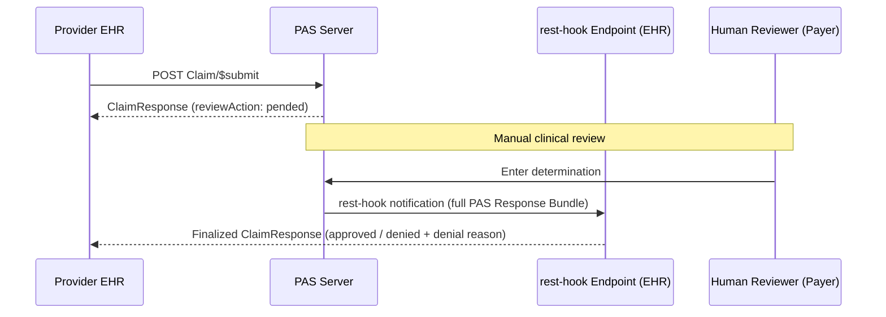
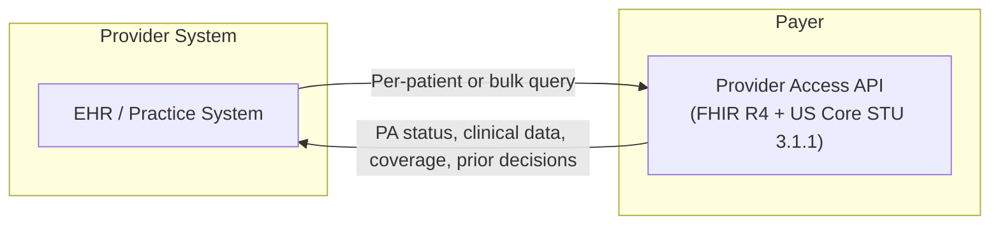
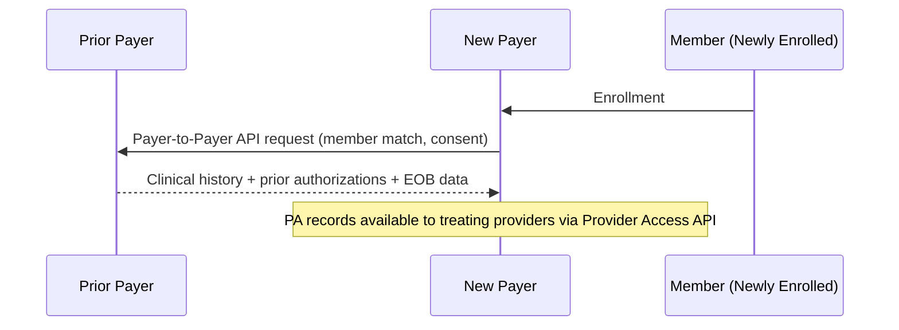

# CMS-0057-F: One More Channel in a Long Stack

Prior authorization as a process has been around for decades, and payers have been running it across a wide range of channels for just as long: phone calls to a nurse reviewer, fax submissions to a clinical team, provider portal web forms, direct X12 278 EDI feeds from large health systems, and proprietary API integrations with major EHR vendors. CMS-0057-F does not replace any of those channels. From what I have seen working through both the regulatory text and the surrounding implementation guides, the rule is narrower than the discussion around it often suggests: it requires impacted payers to expose a FHIR-accessible API on the provider-facing side by January 1, 2027, and it leaves the internal payer architecture entirely untouched. What happens between the FHIR API server and the UM system behind it, whether that is FHIR-to-FHIR, FHIR-to-X12, or FHIR-to-whatever-proprietary-format the adjudication engine expects, is a payer design decision that CMS has not weighed in on.

---

## The Prior Authorization Channel Stack

It is worth mapping out what the actual channel landscape looks like before adding FHIR to the picture, because the rule makes more sense in that context.

The FHIR PA API that CMS-0057-F mandates is the rightmost column. All of the other channels remain fully in place, and a payer that already has a mature X12 EDI operation or a proprietary vendor integration does not need to replace any of that to comply. They need to add a FHIR-accessible surface that providers can call. What the FHIR server does with the incoming request internally is up to them.

---

## What the Rule Actually Mandates

CMS-0057-F (finalized January 17, 2024) applies to Medicare Advantage organizations, Medicaid and CHIP managed care plans and fee-for-service programs, and qualified health plan issuers on federally-facilitated exchanges. It requires four FHIR R4 APIs, all due January 1, 2027, with operational PA decision-time requirements already in effect since January 1, 2026.

The mandate is on the external interface. The four APIs must be FHIR R4.0.1-based, must use US Core IG STU 3.1.1 as the data model, and must support SMART on FHIR for authentication. What the payer's internal systems look like behind that interface is not addressed by the rule. A payer could have a FHIR API server that immediately converts incoming requests to X12 278 and routes them to a legacy adjudication engine, and that would be fully compliant with CMS-0057-F. The February 28, 2024 enforcement discretion from CMS's Office of Burden Reduction and Health Informatics adds one further wrinkle on the external transaction: if a payer implements the FHIR-based PA API per CMS-0057-F, CMS will not enforce the HIPAA requirement to also generate X12 278 transactions on that same request. That discretion is administrative guidance rather than a regulatory change, and it can be rescinded, so the X12 278 remains the underlying HIPAA-mandated standard, but in practice it means payers implementing the FHIR PA API are not required to also run X12 on the external leg.

The two obligations that were already in effect as of January 1, 2026 are the PA decision timeframes, meaning seven calendar days for standard requests and seventy-two hours for urgent requests, and the annual public reporting of aggregated PA metrics, with the first report covering calendar year 2025 due March 31, 2026. Those are operational requirements and apply regardless of which channel the PA request came through.

---

## Where the Da Vinci IGs Fit

The Da Vinci CRD, DTR, and PAS implementation guides are the most-discussed part of the rule in interoperability circles, and it is worth being precise about their regulatory status. CMS lists all three in Table H3 of the final rule as strongly recommended but not required. The binding standards are FHIR R4.0.1, US Core STU 3.1.1, and SMART on FHIR. The Da Vinci IGs describe one way to implement the Prior Authorization API's required capabilities, and it is a well-designed way, but a payer can satisfy the regulatory requirement without implementing CRD, DTR, or PAS specifically.

What the IGs do describe, in more detail than the rule itself, is the end-to-end clinical workflow across the provider-payer interface, and that workflow is what makes the regulation meaningful in practice rather than just a data plumbing obligation. The three guides are each independent: CRD handles the real-time coverage check at the point of order entry, DTR handles the documentation collection, and PAS handles the submission and response exchange.

The Prior Authorization API's four required capabilities, which are determining whether PA is required, identifying what documentation is needed, facilitating electronic submission, and returning an electronic decision, map naturally onto CRD handling the first two and PAS handling the last two. DTR sits in the middle handling the documentation collection step, which is where the clinical burden tends to concentrate in practice.

---

## The Pended Request Path

For requests that require manual clinical review, the PAS IG defines a subscription-based notification path using the R4 Subscriptions Backport implementation guide. The synchronous response returns a pended status, and the final determination arrives via a rest-hook notification with the full PAS Response Bundle. The EHR is expected to monitor pended requests until they reach a final state.

Beyond initial submission and the pended path, the PAS IG defines three additional operations that a conformant server should support: status inquiry, update or revision of a submitted request, and cancellation.

---

## The Provider Access and Payer-to-Payer APIs

The Provider Access API addresses a different problem from the point-of-order PA workflow: treating providers need visibility into PA status and clinical information for their patient panel on an ongoing basis, not only when they are actively placing an order. The API gives provider systems a way to query that information for the patients they are actively managing.

The Payer-to-Payer API handles continuity across plan changes. When a member enrolls with a new plan, the prior payer sends clinical history and prior authorization records to the new plan, which means the member's new plan and their treating providers have access to prior authorization history and documentation without requiring everything to be re-submitted from scratch.

---

## Key Dates

| Obligation | Effective Date |
|---|---|
| PA decision timeframes (72hr urgent / 7-day standard) | January 1, 2026 |
| Specific denial reasons required | January 1, 2026 |
| Annual PA metrics reporting (first report covers CY 2025) | March 31, 2026 |
| All four FHIR APIs (MA, Medicaid/CHIP FFS) | January 1, 2027 |
| All four FHIR APIs (managed care plans, FFE QHP issuers) | Equivalent rating or plan year start on or after Jan 1, 2027 |

---

*Written by Surakshith Sampath. Research grounded in the CMS-0057-F fact sheet, Da Vinci CRD STU 2.1, DTR STU 2.1, and PAS STU 2.x implementation guide specifications, and independent verification across primary and secondary sources as of June 2026.*
